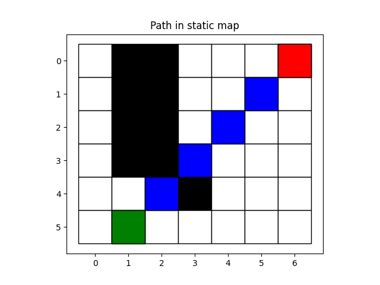
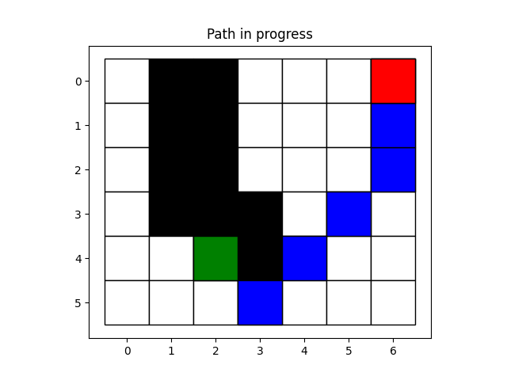
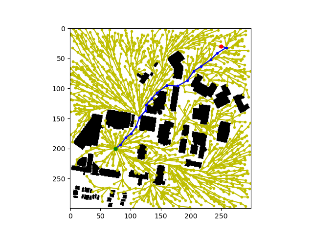
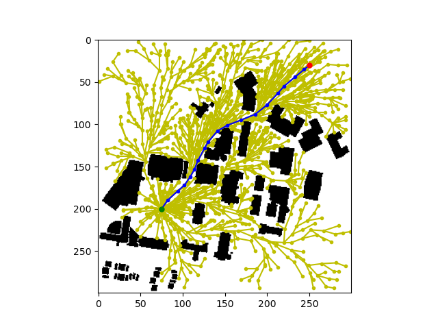

# RBE 550 - Advanced Search Algorithms Implementation

## Overview

In this assignment, you are going to implement **D*** and **Informed RRT*** algorithms. Although they are taught in the lectures, this could be a practice on how you could implement the algorithm by following the pseudocode after reading a paper.

Files are separated into two folders, and they are similar to the previous two assignments

## Instruction

Before starting any coding, please run the code first. Navigating under each of the two folders, and run

`python main.py`

For the **Informed RRT***, the **main.py** loads the map image **WPI_map.jpg** and calls classes and functions to run planning tasks. As you haven't written anything yet, the <u>informed RRT* will give the same result as regular RRT*</u>.

For the **D***,  the **main.py** loads two map, a static one and a dynamic one. The static one is for the initial planning, while the dynamic one tells where the new obstacles are. As you haven't written anything yet, a message should be returned stating no path is found.

Please keep in mind that, the coordinate system used here is **[row, col]**, which is different from [x, y] in Cartesian coordinates. In README and the code comment, when the word '**point**' is used, it refers to a simple list [row, col]. When the word '**node**' or '**vertex**' is used, it refers to either the Node class in RRT ,or a node/vertex in a graph in PRM. 

## D*

 Most of the helper functions are provided, and you are required to implement the main function and some of the key functions of D* algorithm, including

1. The **run** function is the main function of D* algorithm, which includes two main steps. The first step is to search from goal to start in the static map. The second step is to move from start to goal. If any change detected in the second step, the cost should be updated and a new path should be replanned.
2. The **process_state** function that pops node from the open list, and process the node and its neighbors based on the state. 
3. The **prepare_repair** function that senses the neighbors of the given node and locate the new obstacle nodes for cost modification.
4. The **modify_cost** function that modifies the cost from the obstacle node and its neighbor, and put them in the Open list for future search.
5. The **repair_replan** that replans a path from the current node to the goal

After implementing the algorithms, try to run it with the three maps provided to see if the results are desired.

For more details, please go through the lecture and the original paper [Optimal and Efficient Path Planning for Partially-Known Environments](http://web.mit.edu/16.412j/www/html/papers/original_dstar_icra94.pdf). Read the description of the functions and follow the steps.

## Informed RRT*

Most of the code structure is the same as the RRT*'s template, but this time, all the codes that are related to RRT are provided. You will need to modify three parts to implement informed RRT, and they are marked as `TODO` in the template.

1. The first part is within the **main** function of informed RRT, where you need to update the c_best - best length of the path when a path is found. 
2. The second part is within the **sample** function. You need to use different sampling function based on the c_best value. 
3. The last part is to implement the ellipsoid sampling **get_new_point_in_ellipsoid**, so that when a path is found, the samples will be cast within an ellipsoid area for faster convergence.

For more details, please go through the lecture and the original paper [Informed RRT*: Optimal Sampling-based Path Planning Focused via Direct Sampling of an Admissible Ellipsoidal Heuristic](https://arxiv.org/pdf/1404.2334.pdf). Read the description of the functions and follow the steps.

---

Until now, I hope you have a basic understanding of the template code and what to do next. 

This template is only provided as a start point, feel free to make any modification of the codes or code structures if needed. After you finish coding, your algorithms should produce similar results as the images in **demo** folder.

 

 

## Rubrics

- (3.5 pts) Your D* is implemented correctly

  - The **run** function is implemented correctly with two main steps
  - The **process_state** function is implemented correctly to pop the node, process the node and its neighbors based on its state.
  - The **prepare_repair** function is implemented correctly to locate the nodes that need to be updated
  - The **modify_cost** function is implemented correctly to update the cost and put nodes in Open list
  - The **repair_replan** function is implemented correctly to replan a path from current node
  
  ---
  
- (1.5 pts) Your Informed RRT* are implemented correctly

  - Best length of the path is updated once a path is found
  - Sampling methods are used depending on the c_best value
  - Samples are casted in an ellipsoid once a path is found
  
  ---
  
- (1 pts) Documentation

  Besides the code, you should also include a documentation with the following content:

  - Briefly answer the following questions

    - Explain in your own words, how does D* replan a path by updating the cost?
    - Why does D* can replan faster than A* or Dijkstra?
    - What is the key differences between regular RRT* and informed RRT*?
    - By showing and comparing the results of RRT* and informed RRT*, what is the advantages of using the latter?
  
  Include the documentation as a pdf file, or if you prefer, a md file.
