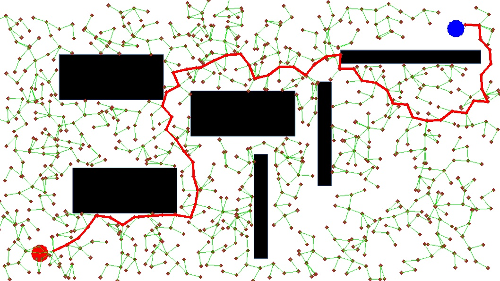
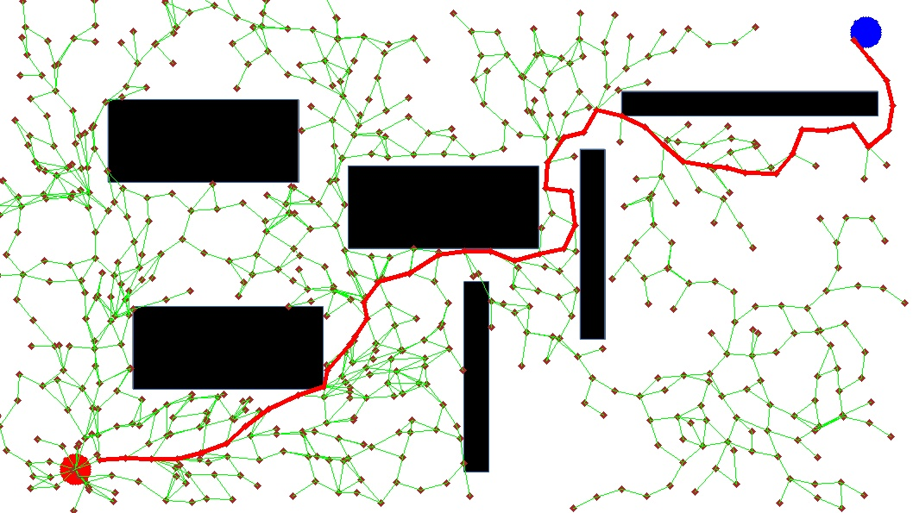

# RRT

Implementation of Rapidly-exploring Random Tree(RRT) and RRT Star(RRT*)

## Vanilla RRT 



## RRT*



## Installation

```bash
$ pip install -r requirements.txt
```

## How to use

```python
$ python main.py --help
usage: main.py [-h] [--map MAP] [--stepsize STEPSIZE] [--alg ALG] [--radius RADIUS]

optional arguments:
  -h, --help           show this help message and exit
  --map MAP            path to map file
  --stepsize STEPSIZE  step size
  --alg ALG            rrtstar or rrt
  --radius RADIUS      radius for rrtstar
```

Example
```python
$ python main.py --map map.png --stepsize 40 --alg rrt
$ python main.py --map map.png --stepsize 40 --alg rrtstar --radius 40
```

When scren pops up, your first clicked position will be a starting point, and second clicked position will be a target point. Path finding process will launch automatically.
