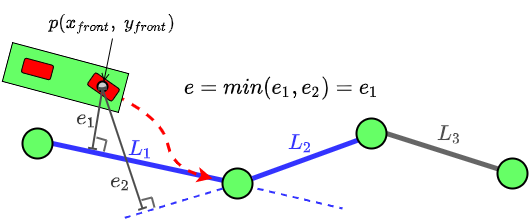
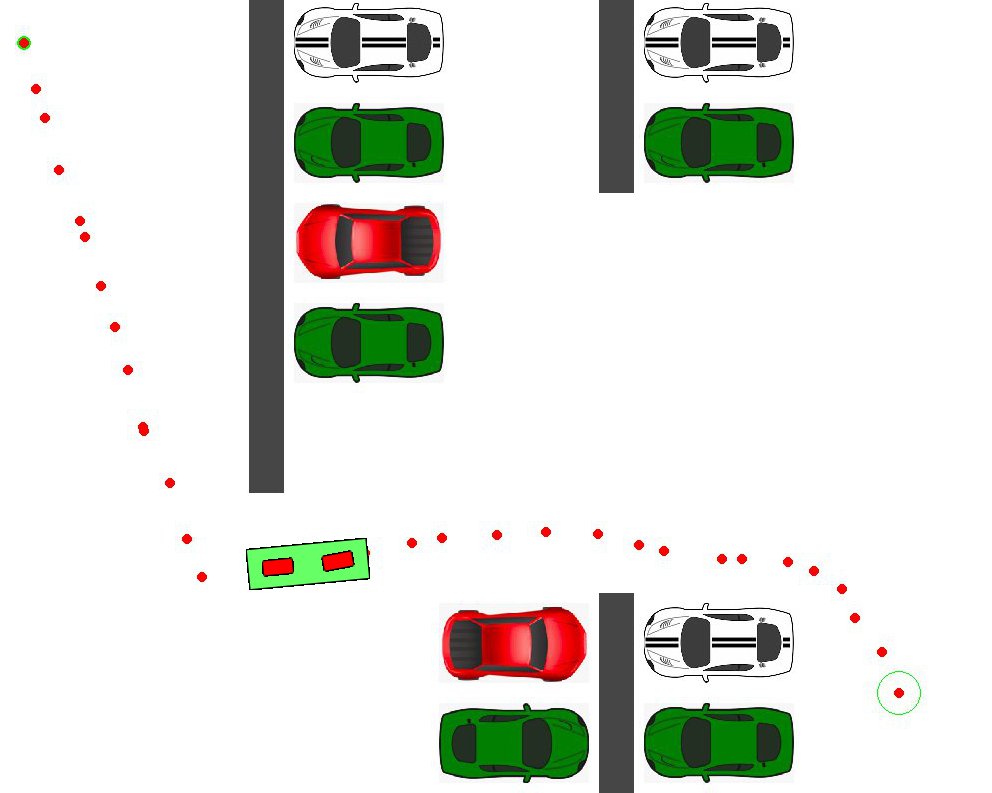
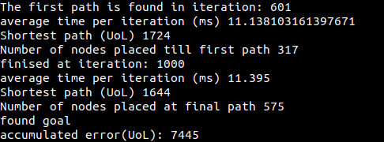
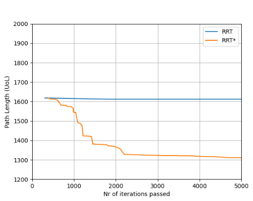

# RRT-star_pygame

[//]: # (Symbols we can use for folder structure  │  ├  ─  └)
The package is organized in the following manner:
```
RRT-star_pygame
 │
 │ 
 │
 ├─── README.md        
 │           
 │
 ├─── code
 │     ├─── main.py
 │     │─── Robot_bicycle_model.py 
 │     └─── RRT_Star.py
 │
 │
 └── image
      └─── ....png


```
 
<p align="justify">

This repository contains the source code of a sampling-based motion planning to autonomously move a robot along a trajectory in a static environment in a parking lot scenario. Both RRT and RRT* single query path planning algorithms were implemented without the use of a planner module, and investigated. A PD controller allows the robot, represented by a kinematic bicycle model, to follow the computed path.

The RRT method and (visualisation using Pygame) were implemented by following a [video tutorial](https://www.youtube.com/watch?v=TzfNzqjJ2VQ). However, the RRT* method and the bicycle model and controller have been implemented without following any tutorials.

Regarding the motion control for the bicycle mobile robot, the steering angle is given by a PD controller using an error e. The error e is defined as the shortest distance(normal distance) between the point of the robot on the front wheel and the 'current' edge. The front wheel position is chosen instead of the center of the robot because it causes less overshoot at the nodes. The error e is calculated as shown in the following figure: 
</p>

<p align="middle">
  
</p>


To run the simulation, please move to `/path/to/code/`, open `main.py` and enter the right path on [this line](https://github.com/yohanlegars/RRT_RRT-star_mobilerobot_pygame/blob/000938339ba1c2b761536418969c8b1546889ade/code/main.py#L15).
Furthermore, you can choose between RRT and RRT* by defining [RRT_STAR](https://github.com/yohanlegars/RRT_RRT-star_mobilerobot_pygame/blob/000938339ba1c2b761536418969c8b1546889ade/code/main.py#L13) False or True, respectively.

Then, in the current directory, you can run:
`python main.py`

A window will appear in which the simulation will start to run. At each iterations, points are randomly generated and connected to the closest available node. The algorithm checks if the vertex and edges are collision free. When the goal is reached, the algorithm backtracks to the start and the shortest path is returned. RRT* adds two additions to RRT, being the recording of the distance each vertex has traveled relative to its parent vertex and rerouting. The simulation is displayed in the figure below:


<p align="middle">
  
</p>

Once the path is found, RRT* allows for rerooting until the shortest path is obtained. The bicycle then appears on the simulation and start following the generated path in order to reach the goal location. Here is what it looks like when the path has been found and the bicycle starts moving:


<p align="middle">
  
</p>

The simulation stops once the goal is reached by the bicycle. A list of metrics is then displayed on the command line as such:

<p align="middle">
  
</p>


## RRT Vs RRT*

RRT and RRT* were both compared. The result demonstrated that RRT* has better performance over RRT with regards to finding the shortest path. In fact, the initial paht found by RRT* is 11% shorter than that found by RRT. As iterations increase RRT* keeps on  reducing the cost. On the other hand RRT* still has a greedier run time explained by its more complex nature.


<p align="middle">
  
</p>


 
